# Udacity-CarND-Traffic-Sign-Classifier  

## Dependency: Running on local machine
* CarND Starter Kit  
Install the car nanodegree starter kit if you have not already done so: [carnd starter kit](https://github.com/udacity/CarND-Term1-Starter-Kit)
* TensorFlow  
If you have access to a GPU, you should follow the TensorFlow instructions for installing [TensorFlow with GPU support](https://www.tensorflow.org/get_started/os_setup#optional_install_cuda_gpus_on_linux).  

Once you've installed all of the necessary dependencies, you can install the ``tensorflow-gpu`` package:``pip install tensorflow-gpu``  
* [Dataset](https://s3-us-west-1.amazonaws.com/udacity-selfdrivingcar/traffic-signs-data.zip)  
 This is a pickled dataset in which we've already resized the images to 32x32.

## 1. Dataset Summary  
```
Number of training examples = 34799
Number of validation examples = 4410
Number of testing examples = 12630
Image data shape = (32, 32, 3)
Number of classes = 43
```
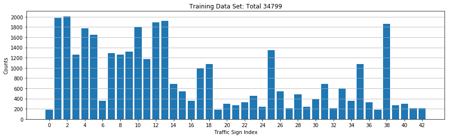
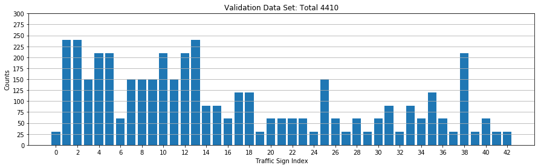
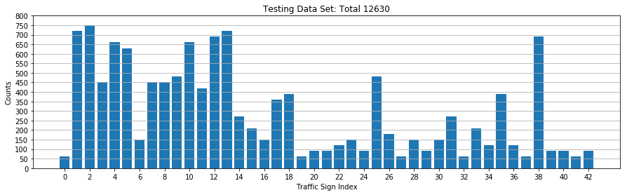  

### Dataset Visualization
Parts of traffic signs are shown below  
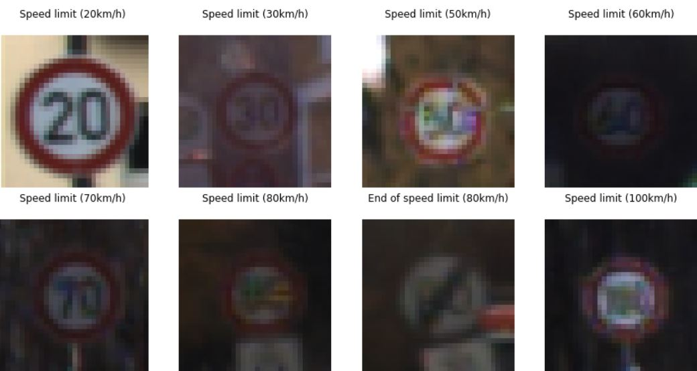  

## 2. Model  
### Image Preprocessing  
As shown in pictures above, Along with shape, also different colors constitute different categories. Therefore, in this project, color channels will be taken as inputs instead of mono
channel as in previous project. Data will be only normalized.
```
def normalize_data(data):
    return (data-128.)/128.
```
### Model Architecture
Different model architectures are created and tested and competing each other for accuracy.  
Parameters for comparing model accuracy are listed below:  
```
EPOCHS = 50
BATCH_SIZE = 128
rate = 0.001
drop_out = 0.5 (LeNet doesnn't use dropout)
```
#### Baseline: LeNet
Maxi accuracy is 0.91.  
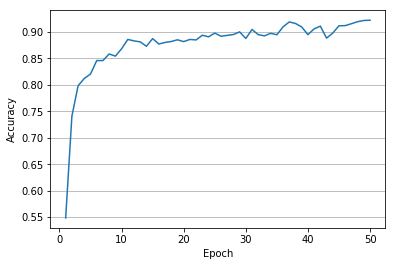

#### Second Model  
Comparing with Lenet, this model removeed Max Pooling to keep the details.  
Also , this model has 3 convolution layers. As shown in the figure below, max accuracy rised to 0.973.
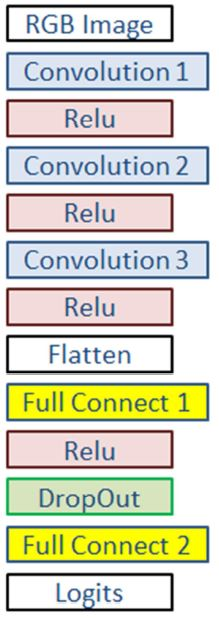 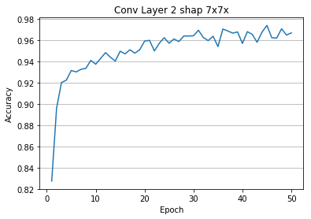

#### Third Model 6 Layer with Dopr and Maxpooling
Max. Accuracy: 0.978. Comparing to model 2, one extra layer shows no significant accuracy improvement  
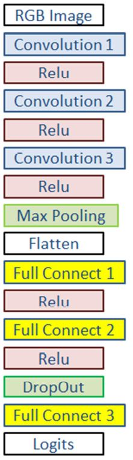 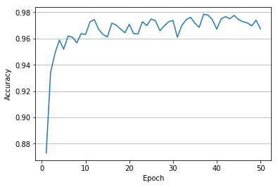

#### Final Model  
Model 2 is chosen as final model.. Model has 3 convolution layers
and 2 fully connected layer. Dropout is used instead of maxpooling.
* Training Parameters  
```
EPOCHS = 120
BATCH_SIZE = 128
rate = 0.0002
drop_out = 0.5
```
* Detailed model structure is list below:  
```
def LeNet_Dropout(x, dropout):    
    # Arguments used for tf.truncated_normal, randomly defines variables for the weights and biases for each layer
    mu = 0
    sigma = 0.1
    
    # SOLUTION: Layer 1: Convolutional. Input = 32x32x3. Output = 26x26x8.
    conv1_W = tf.Variable(
            tf.truncated_normal(shape=(7, 7, 3, 8), mean = mu, stddev = sigma), name = 'conv1_W')
    conv1_b = tf.Variable(tf.zeros(8), name = 'conv1_b')
    conv1   = tf.nn.conv2d(x, conv1_W, strides=[1, 1, 1, 1], padding='VALID') + conv1_b
    # SOLUTION: Activation.
    conv1 = tf.nn.relu(conv1)      

    # SOLUTION: Layer 2: Convolutional. Input = 26x26x8. Output = 20x20x15.
    conv2_W = tf.Variable(
            tf.truncated_normal(shape=(7, 7, 8, 16), mean = mu, stddev = sigma), name = 'conv2_W')
    conv2_b = tf.Variable(tf.zeros(16), name = 'conv2_b')
    conv2   = tf.nn.conv2d(conv1, conv2_W, strides=[1, 1, 1, 1], padding='VALID') + conv2_b    
    # SOLUTION: Activation.
    conv2 = tf.nn.relu(conv2)
    
    # SOLUTION: Layer 3: Convolutional. Input = 20x20x16. Output = 12x12x20.
    conv3_W = tf.Variable(
            tf.truncated_normal(shape=(9, 9, 16, 20), mean = mu, stddev = sigma), name = 'conv3_W')
    conv3_b = tf.Variable(tf.zeros(20), name = 'conv3_b')
    conv3   = tf.nn.conv2d(conv2, conv3_W, strides=[1, 1, 1, 1], padding='VALID') + conv3_b    
    # SOLUTION: Activation.
    conv3 = tf.nn.relu(conv3)        

    # SOLUTION: Flatten. Input = 10x10x20. Output = 2000.
    fc0   = flatten(conv3)
    
    # SOLUTION: Layer 3: Fully Connected. Input = 8000. Output = 2000.
    fc1_W = tf.Variable(
            tf.truncated_normal(shape=(2880, 400), mean = mu, stddev = sigma), name = 'fc1_W')
    fc1_b = tf.Variable(tf.zeros(400), name = 'fc1_b')
    fc1   = tf.matmul(fc0, fc1_W) + fc1_b
    
    # SOLUTION: Activation.
    fc1    = tf.nn.relu(fc1)
    fc1    = tf.nn.dropout(fc1, dropout)   

    # SOLUTION: Layer 5: Fully Connected. Input = 84. Output = 43.
    fc3_W  = tf.Variable(
            tf.truncated_normal(shape=(400, 43), mean = mu, stddev = sigma), name = 'fc3_W')
    fc3_b  = tf.Variable(tf.zeros(43), name = 'fc3_b')
    logits = tf.matmul(fc1, fc3_W) + fc3_b
    
    return logits
```
Max. accuracy 0.976 at epoch 106.  
  

## 3. Model Test on New Images
  

### Prediction
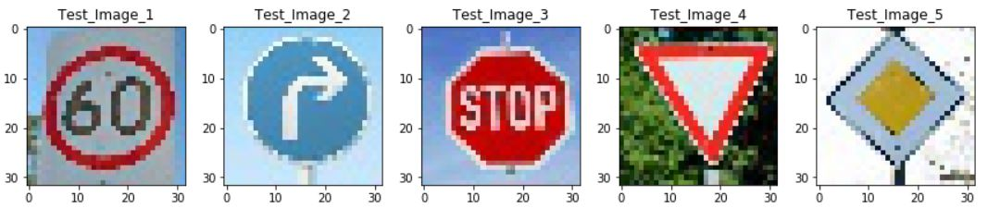  

### Output Top 5 Softmax Probabilities For Each Image  
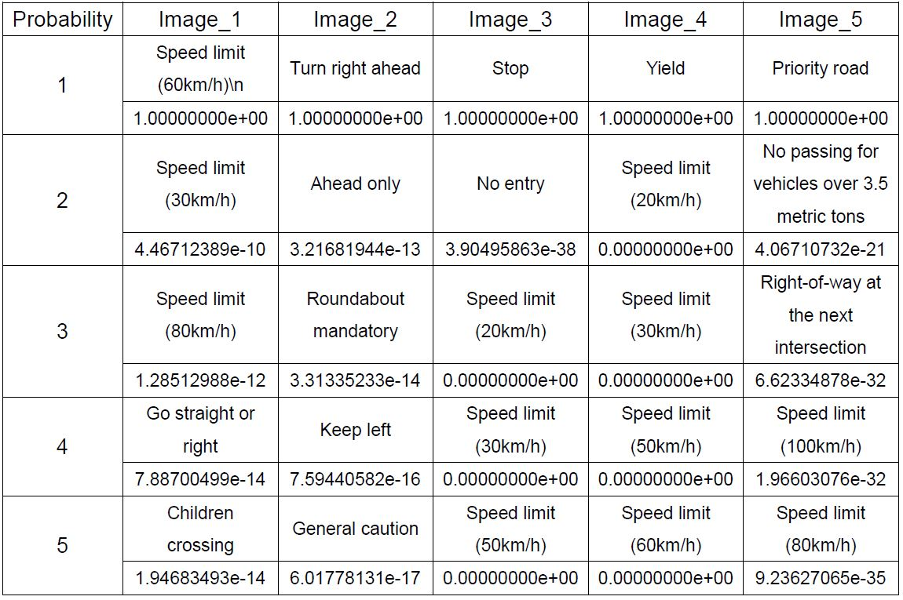
